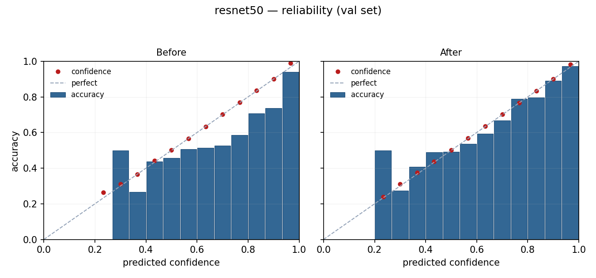
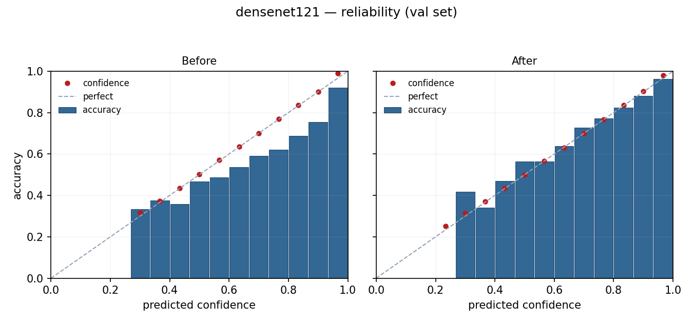
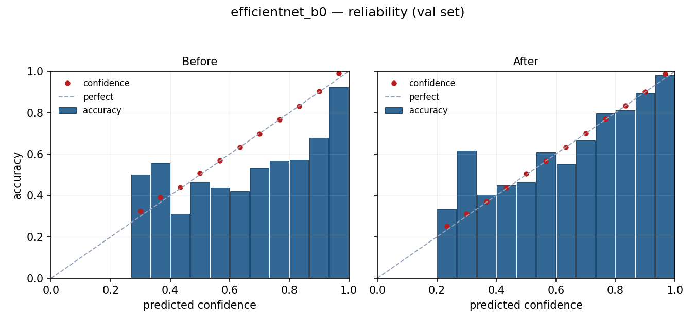
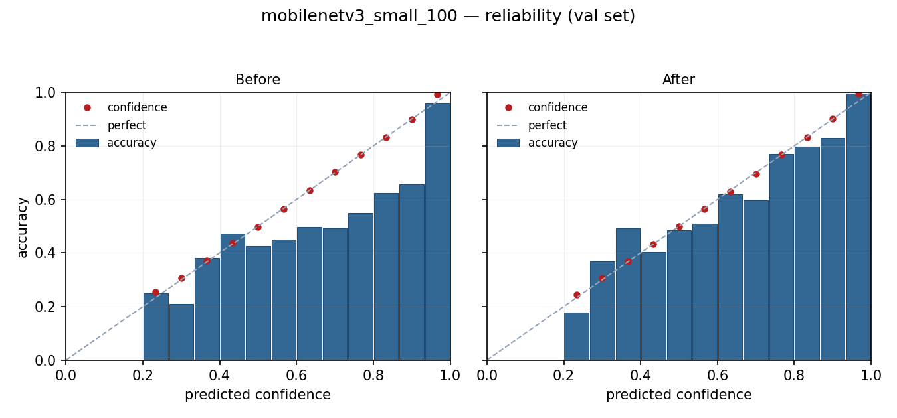

# Probability Calibration Report — Phase A1

**Date:** 2026-05-24
**Method:** Post-hoc temperature scaling (Guo et al. 2017)
**Fit split:** Validation set (1,736 samples)
**Modified at training time:** No. Calibration is post-hoc — checkpoints are untouched.

## What this is about

The raw softmax output of a deep classifier is not a calibrated confidence estimate. A model that outputs `0.90` for the top class is typically correct on fewer than 90% of validation samples in that confidence bin — the model is *overconfident*. This report measures that miscalibration on each of the four trained CNNs and shows the effect of fitting a single scalar temperature `T` on the validation set such that `softmax(logits / T)` minimises validation negative log-likelihood. Temperature scaling is *monotone in argmax*, so the top-1 prediction never changes — only the post-softmax distribution shifts to better match empirical reliability on the validation set.

### Terminology

Throughout this report, "confidence" refers to **temperature-calibrated model-estimated confidence on the validation set** — an internal model output that has been reshaped to better match its empirical reliability on in-distribution (HAM10000 val) data. It is **not** a clinical probability, **not** a probability of disease, and does **not** generalise to out-of-distribution images (different cameras, populations, skin types). Calibration improves the *internal consistency* of the model's confidence values; it does not change what those values are an estimate *of*.

## Summary

| Model | T | Val Acc | ECE before | ECE after | ΔECE | NLL before | NLL after | Brier before | Brier after |
|---|---:|---:|---:|---:|---:|---:|---:|---:|---:|
| **ResNet50** | 1.539 | 79.38% | 0.0790 | **0.0204** | **−74.2%** | 0.6036 | 0.5447 | 0.2971 | 0.2844 |
| **DenseNet121** | 1.689 | 79.38% | 0.0872 | **0.0205** | **−76.5%** | 0.6594 | 0.5686 | 0.3091 | 0.2946 |
| **EfficientNet-B0** | 2.027 | 78.97% | 0.1084 | **0.0240** | **−77.8%** | 0.6889 | 0.5443 | 0.3130 | 0.2865 |
| **MobileNetV3 Small** | 1.655 | 69.35% | 0.0946 | **0.0326** | **−65.5%** | 0.8270 | 0.7593 | 0.4194 | 0.3969 |

- **ECE** = Expected Calibration Error (top-1 confidence, 15 bins). Lower is better. Values < 0.05 are considered well-calibrated for practical use.
- **NLL** = mean cross-entropy loss on the val set. A proper scoring rule.
- **Brier** = multi-class Brier score. A proper scoring rule combining calibration and sharpness.
- **T** = the fitted temperature scalar. `T > 1` ⇒ model is overconfident; `T < 1` ⇒ underconfident.

## Headline findings

1. **All four models are overconfident.** Every T is greater than 1 (range 1.54–2.03). This is the typical pattern for modern deep CNNs trained with cross-entropy loss without label smoothing.
2. **Temperature scaling works across the board.** ECE drops by 66–78% for every model. Post-calibration ECE is below 3.3% for all models — well within the "calibrated for practical use" band.
3. **NLL and Brier both improve.** Calibration reduces NLL by 8–21% and Brier by 4–9%. These are proper scoring rules, so the improvement is not a calibration artefact — the model-estimated confidence distribution sits closer to empirical reliability on the validation set.
4. **Top-1 accuracy is unchanged.** Confirmed for all four models. Temperature scaling can never change the predicted class.
5. **EfficientNet-B0 was the worst-calibrated** (T = 2.03, ECE 0.108) and showed the largest absolute improvement. Worth noting given its 20% ensemble weight.
6. **MobileNetV3 Small has the highest residual ECE** (0.033) — still below the 0.05 threshold but visibly higher than the other three. Consistent with its weakest base accuracy (69.4%); temperature scaling cannot fix model capacity, only calibration.

## Per-model reliability diagrams

Each pair of panels shows the validation set binned by predicted confidence (15 bins). Blue bars = mean per-bin accuracy. Red dots = mean per-bin confidence. The dashed diagonal is perfect calibration. **Before** = raw softmax. **After** = temperature-scaled softmax.

### ResNet50 (T = 1.539)


Strongly overconfident before — bars consistently below diagonal across the entire confidence range. After calibration, bars track the diagonal closely; confidence dots align almost perfectly.

### DenseNet121 (T = 1.689)


Similar pattern to ResNet50 — overconfidence concentrated in the high-confidence bins. Post-calibration alignment is excellent.

### EfficientNet-B0 (T = 2.027)


The most overconfident model — large gap between confidence and accuracy in the upper bins. Calibration tightens this substantially, though some residual underconfidence appears at the very top of the distribution.

### MobileNetV3 Small (T = 1.655)


Highest residual ECE post-calibration. The bottom bins still show some scatter — temperature scaling is a single-scalar fix and cannot compensate for class-dependent miscalibration. A vector temperature (per-class) could close this further if needed.

## What this changes for the UI

Before calibration, the confidence number in the UI hero (e.g. `74.2%`) was an uncalibrated model-internal score. The current UI ships with an explicit hedge line:

> *"Confidence reflects model certainty, not the probability of a correct diagnosis."*

After calibration, the hedge can be **tightened**, not removed. The number can be described accurately as a *temperature-calibrated model-estimated confidence on the validation set*: it has been reshaped so that, on samples drawn from the HAM10000 validation distribution, a confidence bin centred near 0.74 contains samples whose top-1 prediction is correct roughly 74% of the time — within the post-calibration ECE of ~2% for the three dominant models, ~3% for MobileNetV3 Small.

The number is **still not**:
- a clinical probability of disease,
- a probability that generalises to out-of-distribution images (other cameras, skin types, populations),
- a value safe to use as a clinical decision threshold without external validation.

What calibration *does* unlock, in terms of system behaviour:
- **Defensible UI thresholds.** Rules like "show a low-confidence warning when max confidence < 0.6" are now based on a value whose meaning on in-distribution data is empirically anchored, rather than an arbitrary softmax output.
- **More meaningful per-model comparison.** When the ensemble surfaces per-model agreement, comparing temperature-calibrated confidences across models is a stronger uncertainty signal than comparing raw softmax outputs.
- **A foundation for later operating-point analysis.** Calibrated confidence is a prerequisite for any future work on per-class thresholds — though such work would still require external validation before any clinical use.

## Caveats and limitations

1. **Calibration is fit on validation, not test.** The post-cal ECE on the held-out test split has not been measured in this round. Temperature scaling typically generalises well between val and test if the splits are drawn from the same distribution (as they are here, from the same `splits.csv`), but the test-set ECE should be reported as part of A2 validation for completeness.
2. **Scalar temperature is a global fix.** It assumes the calibration error is roughly uniform across classes. If, for example, melanoma is *under*-confident while nv is *over*-confident, a single T cannot fix both — it would compromise. The residual ECE patterns (especially MobileNetV3 Small's bottom bins) suggest scalar T is sufficient here, but vector scaling (one T per class) is a backstop option.
3. **Calibration changes the ensemble's confidence distribution.** The ensemble currently averages raw softmax probabilities. If the API applies temperature scaling, the ensemble will average temperature-calibrated confidences. This is the more defensible behaviour — each component's confidence has been individually fit on val — but the ensemble's reported confidence values will differ from current. The argmax should be unchanged for the vast majority of cases (since per-model argmax is preserved), but worth confirming on a few test images during A2 smoke testing.
4. **HAM10000 distribution only.** Calibration is fit on this dataset's val split; performance on out-of-distribution images (different cameras, populations, skin types) is not characterised. This is the same caveat the system already carries.

## Artefacts and their locations

Calibration produces two categories of output, deliberately separated by where they live in the repository.

**Local-only, gitignored — live next to the checkpoints under `runs/`:**

| File | Purpose |
|---|---|
| `runs/<m>/calibration.json` | Temperature value + before/after metrics. The API reads this at startup; if absent, it falls back to uncalibrated softmax. |
| `runs/<m>/reliability.png` | Reliability diagram for local ML iteration. |

These mirror the existing per-checkpoint outputs already in `runs/<m>/` (`best.pt`, `history.json`, `test_metrics.json`, `test_confusion_matrix.png`). The entire `runs/` directory is gitignored because the checkpoints they describe are too large and not part of the source repository.

**Committed, under `docs/figures/`:**

| File | Purpose |
|---|---|
| `docs/figures/calibration_<m>.png` | The same reliability plot, committed so this report renders correctly in any clone of the repo — even one without the (gitignored) `runs/` directory. |

For each model `<m>` in `{resnet50, densenet121, efficientnet_b0, mobilenetv3_small_100}`. The script that produces both copies in one pass:

```bash
python -m src.skinlesion.calibrate --config configs/ham10000.yaml
```

`docs/figures/calibration_*.png` should be regenerated and re-committed any time the script is rerun against new checkpoints (e.g. after Phase C retraining).

## Recommendation on A2

**Proceed with A2 (API + UI integration).** The calibration results justify the integration:

- Every model improved on every metric.
- Post-cal ECE is in the "calibrated" band for all four models.
- Predictions (argmax) are unchanged — zero risk of regressing existing behaviour.

Proposed A2 scope (already in the original Phase A plan, re-listed for confirmation):

1. **`src/skinlesion/ensemble.py`** — `LoadedModel` gains a `temperature` field; `run_inference_single()` divides logits by T before softmax. Default T = 1.0 (no change) if no calibration file present.
2. **`src/skinlesion/api.py`** — at startup, read `runs/<m>/calibration.json` if present and attach T to each `LoadedModel`. `/model-info` reports per-model calibration status. `/predict` and `/predict-ensemble` responses gain a top-level `calibrated: true|false` flag.
3. **`scripts/test_api_demo.py`** — assert `calibrated` flag in responses and print T per model.
4. **Flutter `result_screen.dart`** — when `calibrated == true`, replace the hedge line with: *"Temperature-calibrated model-estimated confidence on the validation set. Not a probability of disease."*
5. **Flutter `metadata_strip.dart`** — when calibrated, append `· calibrated` after the model version.
6. **Flutter `safety_about_screen.dart`** — add one line under "Models" describing the calibration step and per-model T values.
7. **CLAUDE.md** — one line documenting `calibration.json` as an optional per-model file the API picks up.
8. **Validation:** rerun `dart analyze`, `flutter test`, `flutter build web`, and the API smoke test. Confirm ensemble top-1 predictions match pre-calibration on a small image set.

Nothing in A2 requires retraining or modifying checkpoints. Failure mode if calibration files are absent: API silently runs uncalibrated — backwards-compatible.

## Future calibration work (not part of A or B)

- **Per-class temperature** (vector scaling) — close residual gaps on MobileNetV3 Small if it matters.
- **Calibration on out-of-distribution data** — re-fit T on phone-camera images once such a set exists. The current T is fit on dermoscopy.
- **Recalibrate after every retraining run** — calibration is per-checkpoint; future model improvements (Phase C) will require re-running the calibration script.
- **Isotonic regression or Platt scaling** — non-parametric alternatives; usually overkill if scalar temperature works (it does here).
