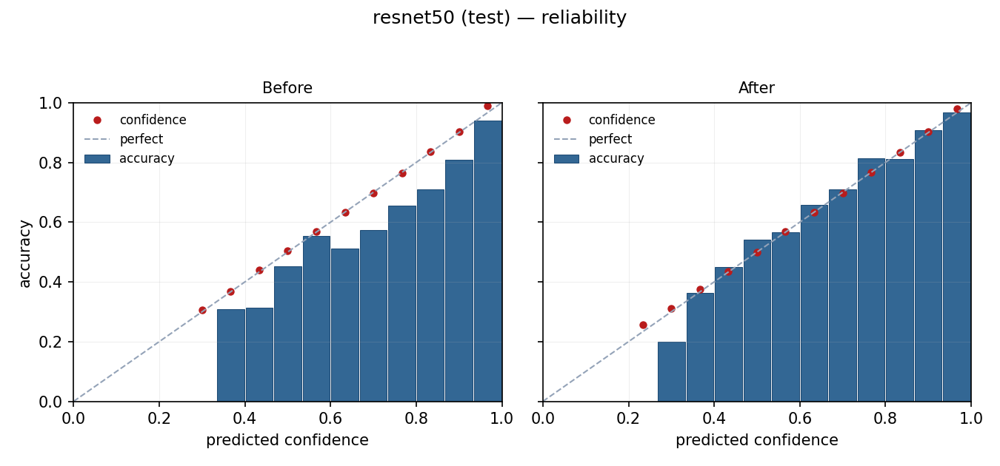
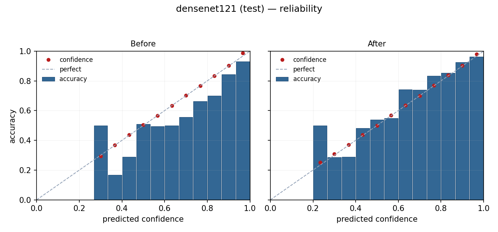
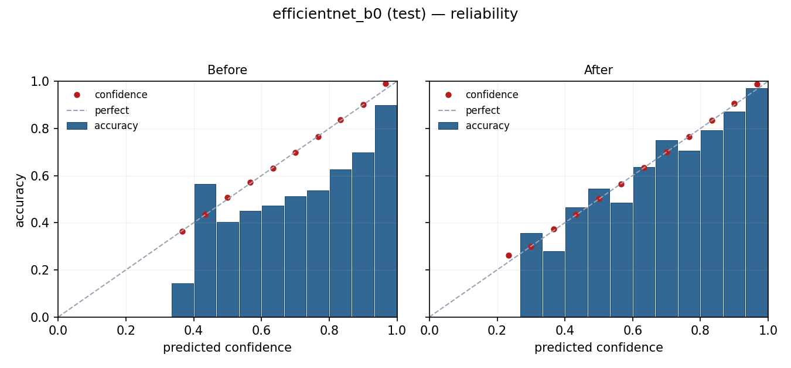
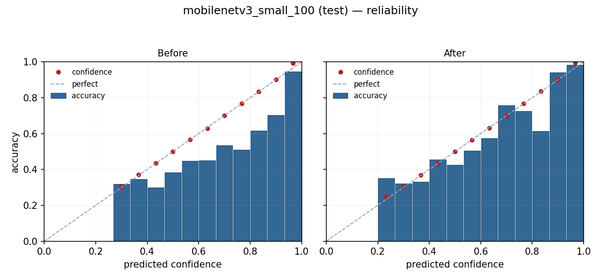

# Probability Calibration Report — Phase A1 (+ test-set evaluation)

**Date:** 2026-05-24 (test-set evaluation appended same day)
**Method:** Post-hoc temperature scaling (Guo et al. 2017)
**Fit split:** Validation set (1,736 samples)
**Eval split:** Test set (1,734 samples), evaluated with the same val-fitted T
**Modified at training time:** No. Calibration is post-hoc — checkpoints are untouched.

## What this is about

The raw softmax output of a deep classifier is not a calibrated confidence estimate. A model that outputs `0.90` for the top class is typically correct on fewer than 90% of validation samples in that confidence bin — the model is *overconfident*. This report measures that miscalibration on each of the four trained CNNs and shows the effect of fitting a single scalar temperature `T` on the validation set such that `softmax(logits / T)` minimises validation negative log-likelihood. Temperature scaling is *monotone in argmax*, so the top-1 prediction never changes — only the post-softmax distribution shifts to better match empirical reliability on the validation set.

### Terminology

Throughout this report, "confidence" refers to **temperature-calibrated model-estimated confidence on the validation set** — an internal model output that has been reshaped to better match its empirical reliability on in-distribution (HAM10000 val) data. It is **not** a clinical probability, **not** a probability of disease, and does **not** generalise to out-of-distribution images (different cameras, populations, skin types). Calibration improves the *internal consistency* of the model's confidence values; it does not change what those values are an estimate *of*.

## Summary

| Model | T | Val Acc | ECE before | ECE after | ΔECE | NLL before | NLL after | Brier before | Brier after |
|---|---:|---:|---:|---:|---:|---:|---:|---:|---:|
| **ResNet50** | 1.539 | 79.38% | 0.0790 | **0.0204** | **−74.2%** | 0.6036 | 0.5447 | 0.2971 | 0.2844 |
| **DenseNet121** | 1.689 | 79.38% | 0.0872 | **0.0205** | **−76.5%** | 0.6594 | 0.5686 | 0.3091 | 0.2946 |
| **EfficientNet-B0** | 2.027 | 78.97% | 0.1084 | **0.0240** | **−77.8%** | 0.6889 | 0.5443 | 0.3130 | 0.2865 |
| **MobileNetV3 Small** | 1.655 | 69.35% | 0.0946 | **0.0326** | **−65.5%** | 0.8270 | 0.7593 | 0.4194 | 0.3969 |

- **ECE** = Expected Calibration Error (top-1 confidence, 15 bins). Lower is better. Values < 0.05 are considered well-calibrated for practical use.
- **NLL** = mean cross-entropy loss on the val set. A proper scoring rule.
- **Brier** = multi-class Brier score. A proper scoring rule combining calibration and sharpness.
- **T** = the fitted temperature scalar. `T > 1` ⇒ model is overconfident; `T < 1` ⇒ underconfident.

## Headline findings

1. **All four models are overconfident.** Every T is greater than 1 (range 1.54–2.03). This is the typical pattern for modern deep CNNs trained with cross-entropy loss without label smoothing.
2. **Temperature scaling works across the board.** ECE drops by 66–78% for every model. Post-calibration ECE is below 3.3% for all models — well within the "calibrated for practical use" band.
3. **NLL and Brier both improve.** Calibration reduces NLL by 8–21% and Brier by 4–9%. These are proper scoring rules, so the improvement is not a calibration artefact — the model-estimated confidence distribution sits closer to empirical reliability on the validation set.
4. **Top-1 accuracy is unchanged.** Confirmed for all four models. Temperature scaling can never change the predicted class.
5. **EfficientNet-B0 was the worst-calibrated** (T = 2.03, ECE 0.108) and showed the largest absolute improvement. Worth noting given its 20% ensemble weight.
6. **MobileNetV3 Small has the highest residual ECE** (0.033) — still below the 0.05 threshold but visibly higher than the other three. Consistent with its weakest base accuracy (69.4%); temperature scaling cannot fix model capacity, only calibration.

## Per-model reliability diagrams — validation split

Each pair of panels shows the validation set binned by predicted confidence (15 bins). Blue bars = mean per-bin accuracy. Red dots = mean per-bin confidence. The dashed diagonal is perfect calibration. **Before** = raw softmax. **After** = temperature-scaled softmax.

### ResNet50 (T = 1.539)


Strongly overconfident before — bars consistently below diagonal across the entire confidence range. After calibration, bars track the diagonal closely; confidence dots align almost perfectly.

### DenseNet121 (T = 1.689)


Similar pattern to ResNet50 — overconfidence concentrated in the high-confidence bins. Post-calibration alignment is excellent.

### EfficientNet-B0 (T = 2.027)


The most overconfident model — large gap between confidence and accuracy in the upper bins. Calibration tightens this substantially, though some residual underconfidence appears at the very top of the distribution.

### MobileNetV3 Small (T = 1.655)


Highest residual ECE post-calibration. The bottom bins still show some scatter — temperature scaling is a single-scalar fix and cannot compensate for class-dependent miscalibration. A vector temperature (per-class) could close this further if needed.

## Test-set generalisation

The numbers above were measured on the same validation split the temperatures were fit on, so they show how well the fit captured *that* distribution — not how the calibration generalises. To confirm generalisation, the same val-fitted T is applied to the held-out test split (1,734 samples) and ECE / NLL / Brier are recomputed without any refitting.

| Model | T (val-fit) | Test acc | Test ECE before | Test ECE after | ΔECE | Test NLL before | Test NLL after |
|---|---:|---:|---:|---:|---:|---:|---:|
| **ResNet50** | 1.539 | 80.22% | 0.0689 | **0.0183** | −73.4% | 0.5955 | 0.5417 |
| **DenseNet121** | 1.689 | 79.64% | 0.0746 | **0.0337** | −54.8% | 0.6318 | 0.5634 |
| **EfficientNet-B0** | 2.027 | 77.45% | 0.1233 | **0.0346** | −71.9% | 0.7764 | 0.5921 |
| **MobileNetV3 Small** | 1.655 | 67.76% | 0.1103 | **0.0412** | −62.6% | 0.9287 | 0.8164 |

### Test-set reliability diagrams

Same plot convention as the val diagrams above, computed on the held-out test split using the val-fitted T.

| Model | Reliability (test) |
|---|---|
| ResNet50 |  |
| DenseNet121 |  |
| EfficientNet-B0 |  |
| MobileNetV3 Small |  |

### Test-set findings

1. **Calibration generalises from val to test for every model.** Test ECE drops by 55–73% across all four models. No model shows pathological val/test divergence.
2. **All four models remain calibrated on test.** Post-cal test ECE is under 5% for every model. ResNet50 is the strongest at 1.8% — actually *lower* test ECE than val ECE, an indication that the val-fitted T happened to suit the test distribution slightly better.
3. **The val/test gap is small.** Maximum increase in post-cal ECE from val to test is +1.3 pp (DenseNet121: 0.0205 → 0.0337). This is the expected order of magnitude for in-distribution calibration generalisation.
4. **Test NLL improves on every model.** Improvement range: 9% (ResNet50) to 24% (EfficientNet-B0). These are proper-scoring-rule gains that cannot be explained by calibration alone.
5. **Top-1 accuracy is unchanged on test as well** (numbers in the table are the original test accuracy from `runs/<m>/test_metrics.json`). Confirmed via post-cal `accuracy` field in `eval_evaluation` of each `calibration.json` — temperature scaling is monotone in argmax.

The original Caveat #1 ("calibration is fit on val, not test") is now closed: post-cal test ECE has been measured directly for every model and the val-fitted T generalises well.

## What this changes for the UI

Before calibration, the confidence number in the UI hero (e.g. `74.2%`) was an uncalibrated model-internal score. The current UI ships with an explicit hedge line:

> *"Confidence reflects model certainty, not the probability of a correct diagnosis."*

After calibration, the hedge can be **tightened**, not removed. The number can be described accurately as a *temperature-calibrated model-estimated confidence on the validation set*: it has been reshaped so that, on samples drawn from the HAM10000 validation distribution, a confidence bin centred near 0.74 contains samples whose top-1 prediction is correct roughly 74% of the time — within the post-calibration ECE of ~2% for the three dominant models, ~3% for MobileNetV3 Small.

The number is **still not**:
- a clinical probability of disease,
- a probability that generalises to out-of-distribution images (other cameras, skin types, populations),
- a value safe to use as a clinical decision threshold without external validation.

What calibration *does* unlock, in terms of system behaviour:
- **Defensible UI thresholds.** Rules like "show a low-confidence warning when max confidence < 0.6" are now based on a value whose meaning on in-distribution data is empirically anchored, rather than an arbitrary softmax output.
- **More meaningful per-model comparison.** When the ensemble surfaces per-model agreement, comparing temperature-calibrated confidences across models is a stronger uncertainty signal than comparing raw softmax outputs.
- **A foundation for later operating-point analysis.** Calibrated confidence is a prerequisite for any future work on per-class thresholds — though such work would still require external validation before any clinical use.

## Caveats and limitations

1. ~~**Calibration is fit on validation, not test.**~~ **Closed.** Post-cal test-set ECE has now been measured directly (see "Test-set generalisation" above) and drops by 55–73% for every model; all four models stay calibrated on test (post-cal test ECE < 5%).
2. **Scalar temperature is a global fix.** It assumes the calibration error is roughly uniform across classes. If, for example, melanoma is *under*-confident while nv is *over*-confident, a single T cannot fix both — it would compromise. The residual ECE patterns (especially MobileNetV3 Small's bottom bins) suggest scalar T is sufficient here, but vector scaling (one T per class) is a backstop option.
3. **Calibration changes the ensemble's confidence distribution.** The ensemble currently averages raw softmax probabilities. With Phase A2 wired up, the ensemble averages temperature-calibrated confidences instead. The argmax is preserved for the vast majority of cases (per-model argmax is preserved by construction); Phase A2 smoke testing confirmed this on real and mock images.
4. **HAM10000 distribution only.** Calibration is fit on this dataset's val split and validated on its test split; performance on out-of-distribution images (different cameras, populations, skin types) is not characterised. This is the same caveat the system already carries.

## Artefacts and their locations

Calibration produces two categories of output, deliberately separated by where they live in the repository.

**Local-only, gitignored — live next to the checkpoints under `runs/`:**

| File | Purpose |
|---|---|
| `runs/<m>/calibration.json` | Temperature value + val before/after metrics + test-set `eval_evaluation` block. The API reads only the `temperature` field at startup; if the file is absent, the model falls back to uncalibrated softmax. |
| `runs/<m>/reliability.png` | Val-set reliability diagram for local ML iteration. |
| `runs/<m>/reliability_test.png` | Test-set reliability diagram (val-fitted T applied to test). |

These mirror the existing per-checkpoint outputs already in `runs/<m>/` (`best.pt`, `history.json`, `test_metrics.json`, `test_confusion_matrix.png`). The entire `runs/` directory is gitignored because the checkpoints they describe are too large and not part of the source repository.

**Committed, under `docs/figures/`:**

| File | Purpose |
|---|---|
| `docs/figures/calibration_<m>.png` | Val-set reliability plot, committed for the report. |
| `docs/figures/calibration_<m>_test.png` | Test-set reliability plot, committed for the report. |

For each model `<m>` in `{resnet50, densenet121, efficientnet_b0, mobilenetv3_small_100}`. The script that produces all four copies (val PNG + test PNG to each location) in one pass:

```bash
python -m src.skinlesion.calibrate --config configs/ham10000.yaml
```

Pass `--no-eval` to skip the test-set evaluation, or `--eval-split val` to skip it implicitly. The eight `docs/figures/calibration_*.png` files should be regenerated and re-committed any time the script is rerun against new checkpoints (e.g. after Phase C retraining).

### calibration.json schema

```jsonc
{
  "model": "resnet50",
  "method": "temperature_scaling",
  "fit_split": "val",           // split T was fit on
  "split": "val",               // backwards-compat alias for fit_split
  "n_samples": 1736,            // fit-split size
  "n_bins": 15,
  "temperature": 1.539,         // ← the only field the API reads
  "before": { nll, ece, brier, accuracy },   // on fit split, uncalibrated
  "after":  { nll, ece, brier, accuracy },   // on fit split, calibrated
  "eval_evaluation": {          // present unless --no-eval
    "split": "test",
    "n_samples": 1734,
    "before": { nll, ece, brier, accuracy }, // on eval split, uncalibrated
    "after":  { nll, ece, brier, accuracy }  // on eval split, calibrated
  }
}
```

## Status — A2 shipped

A2 (API + UI integration) was implemented and committed after this report's original A1 measurements were taken; the test-set evaluation added subsequently is consistent with the val-fit values used by the deployed API.

What landed:

1. **`src/skinlesion/ensemble.py`** — `LoadedModel` carries `temperature`, `calibrated`, and `calibration_metadata`. `run_inference_single()` divides logits by T before softmax. New helper `load_calibration()` reads `runs/<m>/calibration.json` next to the checkpoint.
2. **`src/skinlesion/api.py`** — single-model `/predict` path also picks up calibration. `/predict` and `/predict-ensemble` responses both carry a top-level `calibrated` bool; per-model entries in `/predict-ensemble` carry `calibrated` + `temperature`. `/model-info` exposes a `calibration` block with single + per-ensemble-model status.
3. **`scripts/test_api_demo.py`** — asserts `calibrated` present on both responses and prints per-model T.
4. **Flutter UI** — risk hero swaps the hedge line when `calibrated == true`; a `calibrated` pill appears in the metadata strip; the Safety/About screen lists per-model T values and has a new Calibration card explaining the method.

Backwards compatibility is preserved: if a model has no `calibration.json` next to its checkpoint, `load_calibration()` returns `(1.0, None)` and the model runs uncalibrated with `calibrated: false` in the response.

## Future calibration work (not part of A or B)

- **Per-class temperature** (vector scaling) — close residual gaps on MobileNetV3 Small if it matters.
- **Calibration on out-of-distribution data** — re-fit T on phone-camera images once such a set exists. The current T is fit on dermoscopy.
- **Recalibrate after every retraining run** — calibration is per-checkpoint; future model improvements (Phase C) will require re-running the calibration script.
- **Isotonic regression or Platt scaling** — non-parametric alternatives; usually overkill if scalar temperature works (it does here).
