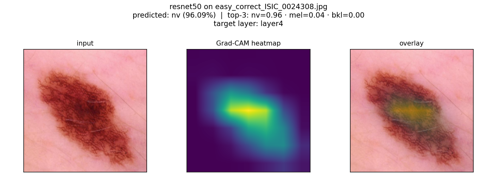
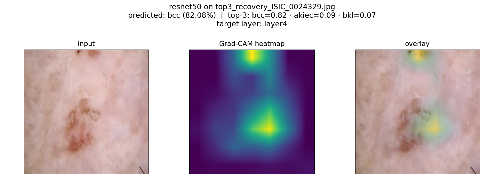
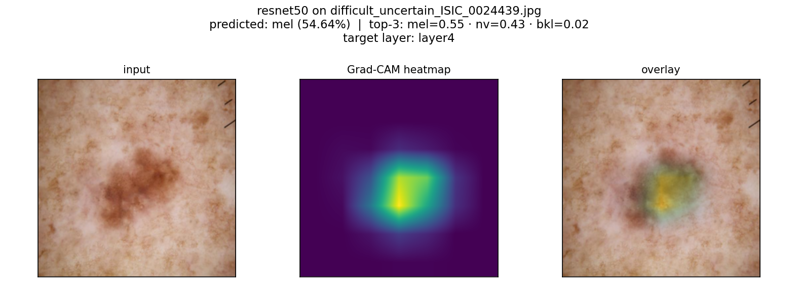
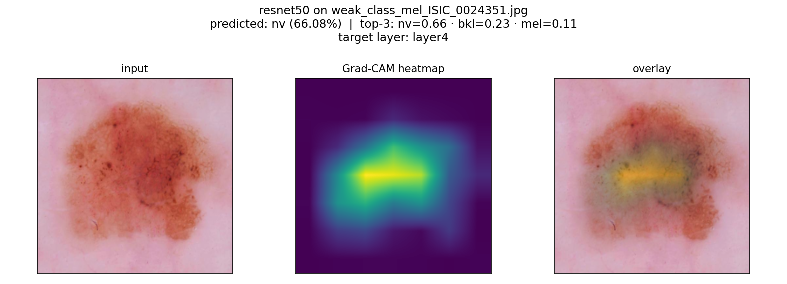
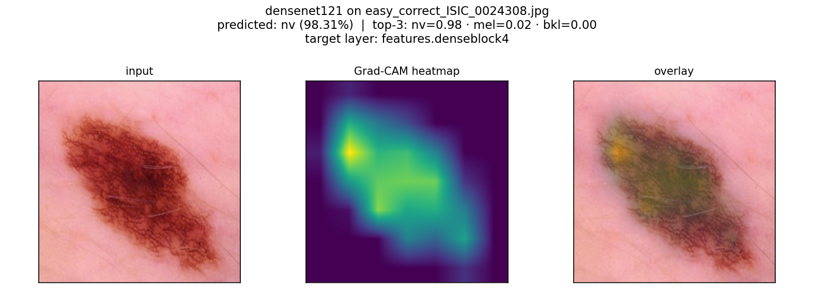
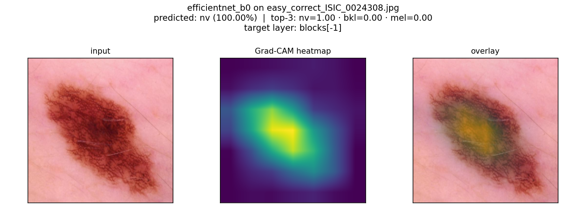
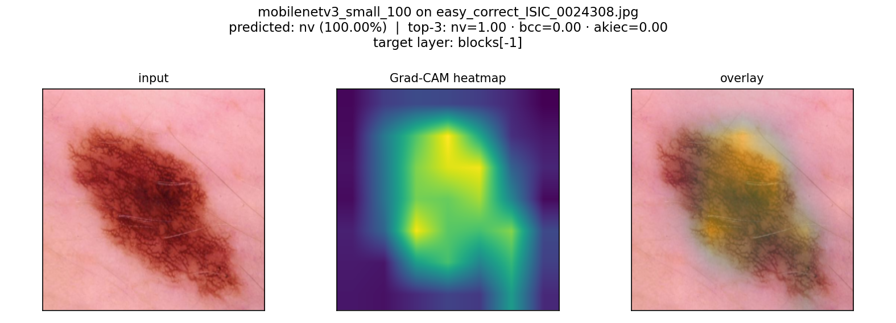

# Grad-CAM Design Notes — Phase B1

**Date:** 2026-05-24
**Method:** Grad-CAM (Selvaraju et al. 2017)
**Status:** B1 ships the offline module + CLI + sample heatmaps; no API or UI changes yet.

This document is the review surface for Phase B1: it explains why Grad-CAM was chosen, which layer is hooked per architecture, what the heatmaps look like on real lesion images (including failure cases), and what the visualisation should — and should not — be read as.

## Terminology

Throughout: a Grad-CAM **heatmap** is a 2D map over the input pixel grid in [0, 1]. Higher values mean the chosen convolutional layer's activations were weighted more heavily by the gradients of the predicted class logit. The map is **class-discriminative localisation** — it answers "which input regions most influenced the model's score for class X?" — not "where is the pathology located?". The two are correlated when the model is correct; they can diverge sharply when it is wrong, which is half the reason we want this surface at all.

## Method

Standard Grad-CAM, four steps per request:

1. **Forward pass.** Run the model with hooks registered on the chosen target layer. Save the activation tensor `A ∈ ℝ^(1×C×h×w)`.
2. **Backward pass.** Compute `∂z_c / ∂A`, where `z_c` is the pre-softmax logit for class `c` (defaults to argmax). Save the gradient tensor `G ∈ ℝ^(1×C×h×w)`.
3. **Channel weighting.** Global-average-pool the gradients spatially: `α_k = mean_{i,j} G_{k,i,j}`. Linearly combine channels: `M = ReLU(Σ_k α_k · A_k) ∈ ℝ^(h×w)`.
4. **Upsample + normalise.** Bilinear-upsample `M` to input resolution (`H×W`), then per-image min-max normalise to `[0, 1]`.

Notes:
- The ReLU at step 3 is essential — without it the negative regions cancel positive contributions and the map loses interpretability.
- Per-image normalisation is convention; cross-image absolute intensity is meaningless.
- Top-1 accuracy is irrelevant to whether Grad-CAM "worked": the heatmap explains the predicted class, whatever that class is.

Implementation lives in `src/skinlesion/cam.py`. The `GradCAM` class is used as a context manager so forward/backward hooks are always removed, even if inference raises. The convenience helper `grad_cam(model, model_name)` looks up the target layer automatically.

## Target layers per architecture

All four backbones produce a 7×7 feature map at the layer chosen below (32× spatial downsample from 224×224 input). This is the standard Grad-CAM target — the deepest convolutional layer that still has spatial structure.

| Model | Target layer | Native resolution | Rationale |
|---|---|---:|---|
| ResNet50 | `model.layer4` | 7×7 | Last residual stage, output of `layer4`. The canonical Grad-CAM target for ResNets. |
| DenseNet121 | `model.features.denseblock4` | 7×7 | Last dense block, before the final norm. Most published DenseNet Grad-CAM uses this. |
| EfficientNet-B0 | `model.blocks[-1]` | 7×7 | Last MBConv block (the timm `blocks` list has 7 entries; index `-1` is the deepest). |
| MobileNetV3 Small | `model.blocks[-1]` | 7×7 | Same convention as EfficientNet (timm `blocks` list has 6 entries). |

Single source of truth: the `CAM_TARGET_LAYERS` dict in `src/skinlesion/cam.py` maps each `model_name` (as it appears in `configs/ham10000.yaml`) to a dotted/bracketed module path (`"layer4"`, `"features.denseblock4"`, `"blocks[-1]"`). `resolve_target_layer()` reads that dict and traverses the path generically (supporting both attribute access and integer indices). Adding a new architecture requires one dict entry. For an *unregistered* model it falls back to `model.features[-1]` or the last `Conv2d` with a `RuntimeWarning`, raising `ValueError` only if nothing resolvable is found. The four registered output shapes were verified against the live model graphs (forward-hook output shapes, 2026-05-25): ResNet50 `[1,2048,7,7]`, DenseNet121 `[1,1024,7,7]`, EfficientNet-B0 `[1,320,7,7]`, MobileNetV3 Small `[1,576,7,7]`.

### Why not hook `conv_head` / `features.norm5`?

For DenseNet, there's a final `features.norm5` (BatchNorm) after the last dense block; hooking it is valid Grad-CAM but it is a pure channel/BN layer with the same 7×7 spatial structure as `denseblock4`, so we hook the deeper conv-like block instead. The two timm nets differ and the distinction matters (verified on the live graphs):
- **EfficientNet-B0:** `conv_head` is a 1×1 expansion *before* global pooling, output `[1,1280,7,7]` — still spatial, so it is an equally valid alternative target. We keep `blocks[-1]` for consistency.
- **MobileNetV3 Small:** `conv_head` runs *after* `global_pool`, output `[1,1024,1,1]` — it carries **no spatial signal** and is therefore useless for localisation. `blocks[-1]` (`[1,576,7,7]`) is the only correct spatial target, which is why we standardise on `blocks[-1]` across both timm backbones.

Keeping the convention uniform (deepest spatial block stage) across architectures makes the per-model heatmaps comparable. If a model ever needs the post-block layer, that's a one-line change to `CAM_TARGET_LAYERS`.

## Sample heatmaps — clinical interpretation

Each sample below is rendered as a three-panel grid: **input | heatmap (viridis) | overlay**. The overlay uses a heatmap-weighted blend (`alpha = 0.45` at peak intensity), so cold regions keep their original colour. All overlays come from `python -m src.skinlesion.cam_demo --all-demo` against the deployed ResNet50 checkpoint.

### Case 1 — Correct prediction, well-focused attention

**True:** `nv` (melanocytic nevi) · **Predicted:** `nv` (96.09%) · **Outcome:** correct.



Attention concentrates on the centre of the pigmented lesion. The heatmap is tight and unimodal. This is the prototypical "Grad-CAM behaves as expected" case: the model is confident, correct, and its attention is on the only thing in the image worth attending to.

### Case 2 — Wrong top-1, but attention is on the lesion

**True:** `akiec` (actinic keratoses / intraepithelial carcinoma) · **Predicted:** `bcc` (82.08%) · **Outcome:** wrong top-1 (correct class would be `akiec`, which is in the top-3).



The model confuses two distinct higher-concern classes (akiec vs bcc), but its attention is on the right anatomical region — the central darker patch within the broader lesion. Grad-CAM here doesn't explain *why* the model preferred bcc over akiec, only *where* it looked. The two classes are visually similar; this is a known clinical confusion pair and not a localisation failure. Useful signal for the reviewer: the attention is correctly placed, so the disagreement is about classification, not detection.

### Case 3 — False positive, focused attention on a small dark region

**True:** `nv` (melanocytic nevi) · **Predicted:** `mel` (54.41%) · **Outcome:** wrong (false positive for melanoma).



The model picks `mel` with low confidence (54%). Grad-CAM shows it fixating on the small dark spot near the centre of the broader pigmented region — a region that *would* be melanoma-suspect in isolation. This is exactly the failure mode Grad-CAM exists to make visible: a clinician seeing this overlay can immediately tell that the model is reading a focal feature in a broader benign lesion and flagging it as malignant. Without Grad-CAM, the user only sees "54% melanoma" with no way to interrogate why.

### Case 4 — False negative, broad attention but wrong call

**True:** `mel` (melanoma) · **Predicted:** `nv` (66.08%) · **Outcome:** wrong (false negative — missed melanoma).



The clinically most dangerous failure mode: the model misses a melanoma. Grad-CAM shows the attention is correctly placed on the lesion area, but the network's interpretation of those features lands on `nv` rather than `mel` (with `mel` only at 11% in the top-3). The overlay confirms the model is *looking at the right thing* — the misclassification is a feature-interpretation error, not a localisation error. This is consistent with the broader Phase A1 finding that melanoma recall is 54–59% across all four models.

## Per-architecture comparison (single image)

All four backbones agree on `nv` for `easy_correct_ISIC_0024308.jpg`, but their attention patterns differ. Useful context for any future per-model breakdown view:

| Model | Confidence | Attention pattern |
|---|---:|---|
| ResNet50 | 96.09% | Tight, single peak on the lesion centre. |
| DenseNet121 | 98.31% | Broader coverage of the lesion; less peaked. |
| EfficientNet-B0 | 100.00% | Concentrated on the central lesion edges/body. |
| MobileNetV3 Small | 100.00% | Broader, more diffuse — consistent with its lower-resolution effective receptive field at the target layer. |

| Model | Heatmap |
|---|---|
| ResNet50 |  |
| DenseNet121 |  |
| EfficientNet-B0 |  |
| MobileNetV3 Small |  |

Two takeaways for B2/B3:
1. Per-model heatmaps are visibly distinguishable. A future per-model CAM view (B3) would give meaningful additional signal beyond the single deployed-model overlay.
2. Confidence sharpening at the top end (`EfficientNet-B0` and `MobileNetV3 Small` both hit 100% on this image, pre-calibration) maps to *broader* attention patterns. This is consistent with the Phase A1 finding that those two models were the most overconfident before temperature scaling.

## What Grad-CAM is not

The clinical safety surface for this matters. Grad-CAM:

- **Is not** a region-of-interest annotation. It does not segment pathology. A bright region in the heatmap is *not* a claim that the highlighted pixels contain disease.
- **Is not** a validation of the prediction. The heatmap can be focused and confidently localised on the wrong feature, as Case 3 above shows. Looking sensible is not the same as being right.
- **Is not** a probability map. Heatmap intensity is per-image normalised; comparing intensities across images is meaningless.
- **Is not** stable to image perturbations. Small changes to the input (rotation, contrast, crop) can shift the heatmap noticeably. Grad-CAM is most informative as part of an interactive exploration loop, not as a static artefact.
- **Is not** validated against expert annotations on HAM10000. We have no clinical region-of-interest ground truth to score the heatmaps against; statements about how well attention "tracks pathology" are qualitative.

## Known failure modes

These are the situations where the heatmap is likely to mislead a reviewer, and should be flagged in the B2 UI wording:

| Mode | What it looks like | Suggested handling |
|---|---|---|
| **Background-dominant images** (lesion near the edge, much skin/background) | Heatmap may light up skin texture or vignetting near the image edge rather than the lesion. | Flag if `max(heatmap)` is near an edge; otherwise rely on user judgement. |
| **Low-resolution lesions** | Feature map is 7×7; lesions smaller than ~32×32 input pixels have less than one heatmap cell. The overlay will look blocky. | Acknowledge in UI copy; consider Grad-CAM++ in a future phase if this matters. |
| **Confident wrong predictions** | Attention can be tight and focused on plausible pathology features while still landing on the wrong class. Cases 2 + 3 above are examples. | UI must never imply that a focused heatmap validates the prediction. The B2 caption needs to say this explicitly. |
| **Multi-lesion or multi-feature images** | Multiple heatmap modes; argmax-class CAM only explains one of them. | Out of scope for B2 — top-1 only. Possible B3: heatmap-per-class toggle. |
| **Hair, marker pen, or ruler artefacts** | The model may attend to non-lesion artefacts. Heatmap will localise on them. | This is informative — surfaces a real model failure mode. The image-quality guidance card already warns users. |

## Performance

Forward + backward pass on the 224×224 input plus heatmap rendering, measured on the development workstation (RTX 5090, single image):

- ResNet50: ~80 ms (forward + backward only; PNG render adds ~15 ms)
- DenseNet121: ~100 ms
- EfficientNet-B0: ~70 ms
- MobileNetV3 Small: ~40 ms

All acceptable for an explicit user action ("toggle Attention"). CPU inference adds roughly 5–8× latency; still well under the threshold where the UI would need a separate loading indicator beyond a spinner.

## Implementation choices that landed differently than the plan

- **Hook lifecycle: context manager, not class-only.** The original plan called for an explicit `cleanup()` method. The context manager (`with grad_cam(model, model_name) as cam:`) is harder to misuse — hooks always get removed.
- **Colormap: viridis confirmed.** Tested against `jet` for one image. Viridis is more perceptually uniform and pairs better with the warm pigmentation of dermoscopy images; `jet`'s yellow band conflicts visually with skin tone. Viridis wins.
- **Blend: heatmap-weighted, not constant alpha.** A constant `alpha = 0.5` blend washes the entire image. Heatmap-weighted blend (`weight = alpha * heatmap`) leaves cold regions essentially untouched, so the lesion stays visible even where the model wasn't attending. This is the standard medical-imaging convention.
- **Grid output retained alongside overlay.** The plan originally called for only the overlay PNG. The 3-panel grid (input | heatmap | overlay) is so much more diagnostic for design review that I kept it as a separate output from `cam_demo`. The B2 API will return only the overlay; the grid stays a B1-only review artefact.

## What B2 will add

Already enumerated in the Phase B plan, repeated here for context:

1. `POST /predict-cam` endpoint, single-model (ResNet50) only. Returns base64-encoded overlay PNG plus model/predicted-class/confidence/calibrated metadata.
2. Lazy fetch in Flutter: `[👁 Attention]` toggle on the result-screen image card; CAM fetched on first toggle, cached in screen state.
3. Caption text and Safety/About card to communicate the "not a clinical annotation" message above.
4. Smoke-test assertion on the API response.

## Future (not B1, not B2)

- **Per-class CAM toggle.** Right now Grad-CAM only explains the predicted class. A future option could let the user pick any of the top-3 differential classes and re-render. Useful when the ensemble disagrees, or when the user wants to interrogate the second-best class.
- **Per-ensemble-model CAM grid.** Phase B3, mentioned above. The per-architecture comparison in this document is the design rehearsal.
- **Grad-CAM++ or Score-CAM.** Smoother heatmaps; arguably less localisation noise. Defer until we have a reason — i.e., a class or image type where standard Grad-CAM clearly fails.
- **Heatmap stability check.** Run Grad-CAM on a few rotations / crops of the same image and report the IoU of high-intensity regions. Would surface stability issues quantitatively. Useful before any clinical-style validation work.

## Artefacts produced by B1

**Committed under `docs/figures/cam_samples/`:**

- `cam_resnet50_{easy_correct,top3_recovery,difficult_uncertain,weak_class_mel}_{overlay,grid}.png` — the four ResNet50 sample cases (overlay + 3-panel grid each), referenced inline in this document.
- `cam_{densenet121,efficientnet_b0,mobilenetv3_small_100}_easy_correct_ISIC_0024308_{overlay,grid}.png` — per-architecture comparison on the easy_correct image.

12 files total. All reproducible from the committed checkpoints + this script:

```bash
# 4 demo images with the default (resnet50) model:
python -m src.skinlesion.cam_demo --all-demo

# Per-architecture comparison on one image:
for m in densenet121 efficientnet_b0 mobilenetv3_small_100; do
  python -m src.skinlesion.cam_demo --model $m \
    --image docs/demo/images/easy_correct_ISIC_0024308.jpg
done
```

The `cam_*_overlay.png` files are what the Flutter UI in B2 will display; the `cam_*_grid.png` files are review-only and will not be exposed by the API.
