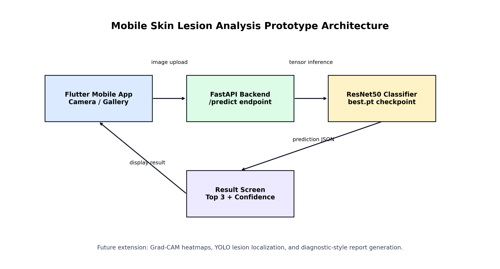
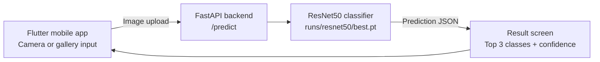

# Mobile App Architecture

The prototype uses Flutter as the mobile frontend and FastAPI as the model
serving backend. The first mobile version uploads a camera/gallery image to the
backend, where the ResNet50 checkpoint performs classification and returns the
predicted class, confidence score, and top candidates.

